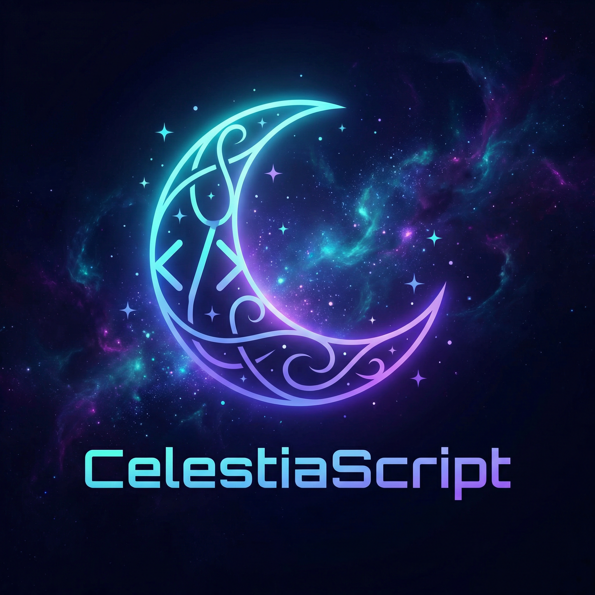

<div align="center">



<br/><br/>

# ✨ CelestiaScript ✨

### *A cosmic programming language where stardust meets code*

<br/>


<br/>

> *"Write code that resonates with the universe — where every variable shines like a star and every loop bends the fabric of space-time."* 🌌

</div>

---

## 🌌 About CelestiaScript

**CelestiaScript** is a cosmic programming language that bridges the universe and code. Every script you write resonates with the stars — harness the power of **quantum harmonics**, **starlight variables**, and **nebula operators** to craft programs that transcend ordinary code.

Born from the intersection of celestial mechanics and modern computation, CelestiaScript empowers developers to think beyond conventional paradigms and write logic that flows like the cosmos itself.

---

## 🚀 Features

| Feature | Description |
|---|---|
| ⚛️ **Quantum Harmonics** | Harness quantum states and superposition in your logic |
| 🌟 **Starlight Variables** | Variables that shine with cosmic energy and adapt dynamically |
| 🌀 **Cosmic Functions** | Functions that orbit through the fabric of computation |
| 🕳️ **Event Horizon Loops** | Loops that bend time and space, defying conventional iteration |
| 🔭 **Astral Pointers** | Navigate memory across parallel universes like navigating the cosmos |
| 💫 **Nebula Operators** | Operators born from the heart of a dying star |

---

## 📂 Repository Structure

```
CelestiaScript/
├── assets/
│   ├── celestiascript-logo.png      # ✨ Official CelestiaScript logo
│   ├── celestiascript-banner.png    # Repository banner
│   └── celestiascript-icon.png      # Repository icon
├── Quantum Harmonics.js             # ⚛️ Quantum state logic
├── Starlight Variables.js           # 🌟 Dynamic variable system
├── Cosmic Functions.js              # 🌀 Orbital function structures
├── Event Horizon Loops.js           # 🕳️ Space-time loop mechanics
├── Astral Pointers.js               # 🔭 Multi-dimensional memory pointers
├── Nebula Operators.js              # 💫 Stellar operator expressions
└── LICENSE
```

---

## 🌠 Getting Started

Clone the repository and explore the cosmic modules:

```bash
git clone https://github.com/Infinite-Networker/CelestiaScript.git
cd CelestiaScript
```

Run your first CelestiaScript program:

```bash
node "Cosmic Functions.js"
node "Starlight Variables.js"
node "Quantum Harmonics.js"
```

---

## 🪐 Quick Example

```js
// 🌟 Starlight Variable
let starlight = "Infinite energy from the cosmos";

// 🌀 Cosmic Function
function create_constellation(stars, name) {
    for (let i = 0; i < stars; i++) {
        console.log(`⭐ Star ${i + 1} placed in the sky`);
    }
    console.log(`${name} now shines in the night sky! ✨`);
}

create_constellation(5, "Cassiopeia");
```

---

## 📜 License

This project is licensed under the **MIT License** — see the [LICENSE](LICENSE) file for details.

---

<div align="center">


<br/>

*Crafted with 🌌 stardust and ✨ code by [Cherry Computer Ltd.]*

</div>
